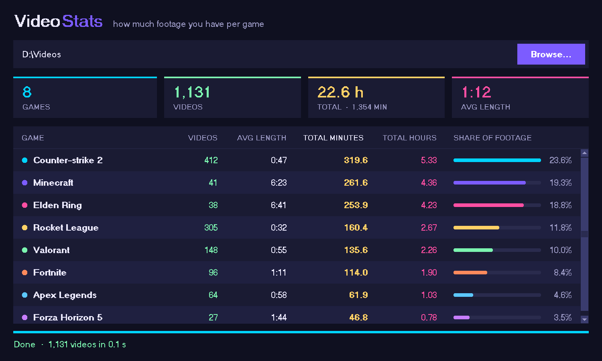

# Video Stats

A small Windows-friendly app that tells you how much footage you have per game.

Pick a folder (for example your ShadowPlay `Videos` folder). Every sub-folder counts as one game, and for each one you get:

- how many videos there are
- how long they are on average
- total minutes and total hours
- its share of all your footage



*(The screenshot uses sample data.)*

## Run it

With Python 3 installed:

```
python video_stats.py
```

No extra packages are needed.

## Get the .exe without building it yourself

This repo builds the Windows `.exe` automatically on GitHub:

1. Open the **Actions** tab of the repo.
2. Click the latest **Build Windows exe** run (or press **Run workflow** to start one).
3. Download **VideoStats-windows** at the bottom of the run page and unzip it.

Windows may show a "Windows protected your PC" warning the first time, because the exe is not signed. Click **More info → Run anyway**.

## How it works

- Videos are grouped by the first-level folder name. Videos lying loose in the chosen folder are grouped by their title with the date removed (`Rocket League 2023.05.12 - 21.33.44.01.mp4` → `Rocket League`).
- The length is read from the MP4/MOV header, so the video itself is never read. This keeps scanning hundreds of gigabytes quick.
- Results are remembered in `%LOCALAPPDATA%\VideoStats\cache.json`, so the next scan only checks new or changed files. Delete that file to start fresh.
- Other formats (mkv, avi, webm, …) are only measured if [ffmpeg](https://ffmpeg.org/) is installed.
- Click a column heading to sort by it.
